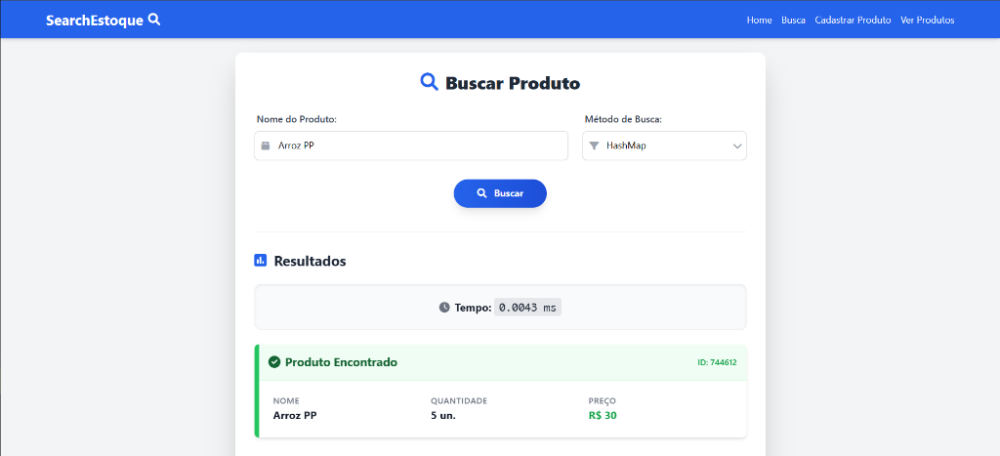
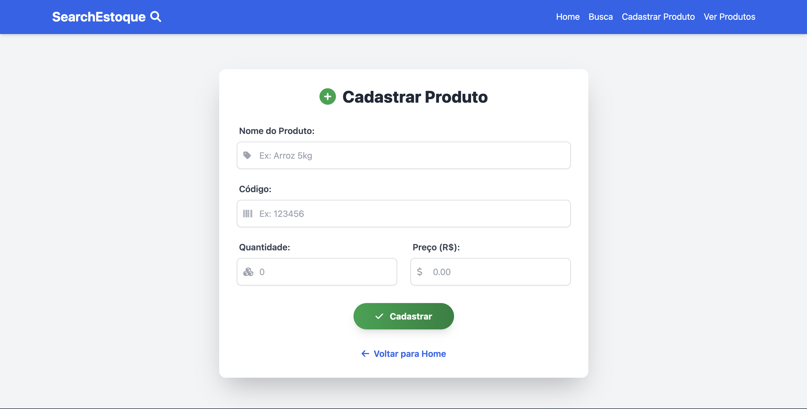
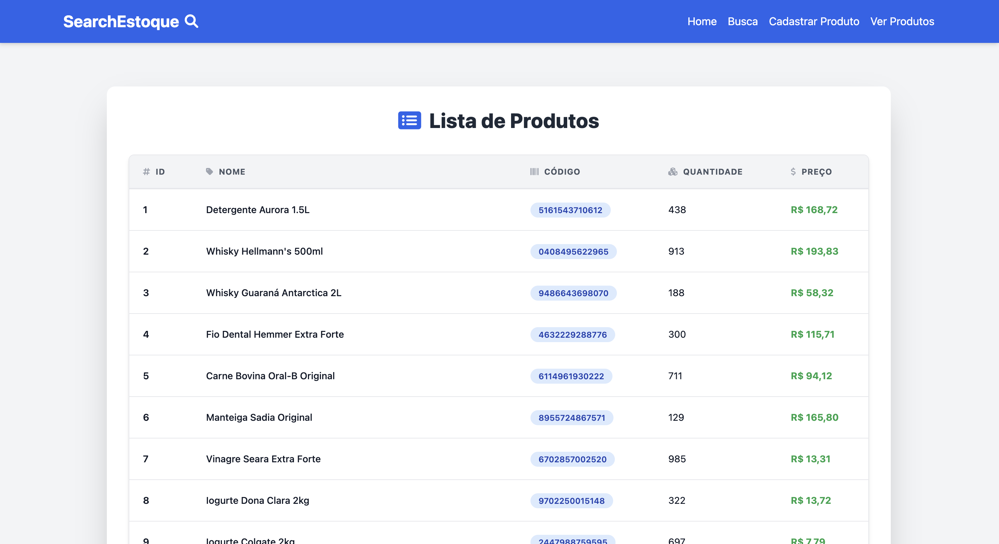

# Projeto de SearchEstoque - Algoritmos e Estruturas de Dados II

Este projeto foi desenvolvido como parte da disciplina de Algoritmos e Estruturas de Dados II. O objetivo principal é demonstrar e comparar a performance de três diferentes métodos de busca (Indexada, Sequencial e HashMap) em um cenário de sistema de controle de estoque.

O sistema permite o cadastro de produtos, atualização de estoque e, principalmente, a busca desses produtos utilizando os diferentes algoritmos, exibindo o tempo de execução de cada operação.

## Tecnologias Utilizadas

- **Backend**: Python com Framework Django
- **Banco de Dados**: SQLite
- **Frontend**: HTML, CSS (Tailwind CSS)

## Implementação dos Métodos de Busca

Abaixo detalhamos como cada um dos três métodos de busca foi tecnicamente implementado no sistema. O código fonte principal dessas lógicas encontra-se em `estoque/views/busca.py`.

### 1. Busca Indexada (SQL)

A busca indexada delega a responsabilidade da pesquisa para o Banco de Dados. Ela é implementada executando uma consulta SQL direta com a cláusula `WHERE`.

- **Como funciona**: O sistema envia uma query `SELECT * FROM estoque_produto WHERE nome = %s` para o banco de dados.
- **Performance**: O banco de dados utiliza seus próprios mecanismos de otimização (como índices B-Tree, se configurados) para localizar o registro rapidamente sem precisar varrer toda a tabela. É geralmente muito eficiente para grandes volumes de dados.

### 2. Busca Sequencial

A busca sequencial é implementada "manualmente" no nível da aplicação (Python), simulando o comportamento de varrer uma lista item por item.

- **Como funciona**:
  1. O sistema carrega **todos** os registros da tabela de produtos para a memória usando `SELECT ... FROM estoque_produto`.
  2. Em seguida, itera sobre essa lista usando um laço de repetição (`for`).
  3. Para cada produto, compara se o nome corresponde ao termo pesquisado.
  4. O loop é interrompido (`break`) assim que o item é encontrado.
- **Performance**: Possui complexidade O(N). Quanto mais produtos existirem no banco, mais lenta será a busca, pois no pior caso (item não encontrado ou último da lista) ela precisa verificar todos os registros.

### 3. Busca por HashMap (Tabela Hash)

A busca por HashMap utiliza uma estrutura de dados em memória (Dicionário do Python) para fornecer acesso quase instantâneo aos dados.

- **Como funciona**:
  1. O sistema verifica se já existe um HashMap carregado em memória (cache global).
  2. Se não existir (primeira busca), ele carrega todos os produtos do banco e constrói um dicionário onde a **chave** é o nome do produto e o **valor** são os dados do produto.
  3. As buscas subsequentes acessam diretamente esse dicionário usando a chave (`mapa_produtos[termo]`).
- **Performance**: A busca em si tem complexidade média O(1), ou seja, é extremamente rápida e o tempo de busca não aumenta significativamente com a quantidade de itens. No entanto, existe um custo inicial para carregar os dados e construir o mapa na memória.

## Telas do Sistema

### Busca de Produtos

### Cadastro de Produtos

### Lista de Produtos

## Como Executar

1. Certifique-se de ter o Python instalado.
2. Instale as dependências: `pip install -r requirements.txt`
3. Execute as migrações do banco: `python manage.py migrate`
4. Popule o banco com dados de teste: `python manage.py popular_banco`
5. Inicie o servidor: `python manage.py runserver`
6. Acesse no navegador: `http://localhost:8000`
